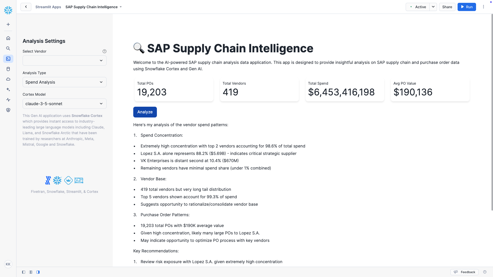

# SAP Supply Chain Intelligence Streamlit in Snowflake Gen AI Data App

## Overview
The **SAP Supply Chain Intelligence Gen AI Data Application** combines **Fivetran**, **Snowflake**, **dbt**, **Streamlit**, and **Gen AI** (powered by **Snowflake Cortex**) to deliver insights into SAP supply chain and purchase order data. This application extracts raw data from SAP HANA, transforms it into Generative AI-ready formats, and enables Gen AI-powered analysis through an interactive data application.



## Data Flow

### 1. **Bronze Layer**: Raw Data Ingestion
- **Source**: SAP HANA
- **Ingestion Tool**: Fivetran's **Automated Data Movement** platform using the SAP ERP on HANA connector
- **Raw Tables**: Data is ingested into the `HOL_DATABASE.DHSAPHANA_SAPABAP1` schema

**List of Tables**:
- `AFIH`, `AFKO`, `AUFK`, `DD07L`, `DD07T`, `EKBE`, `EKES`, `EKET`, `EKKO`, `EKPO`
- `KNA1`, `LFA1`, `LIKP`, `LIPS`, `MAKT`, `MARA`, `PMCO`, `QMEL`, `QMFE`, `QMIH`
- `QMSM`, `QPCD`, `QPCT`, `QPGR`, `QPGT`, `T001`, `T001W`, `T005`, `T005T`, `T024`
- `T024E`, `T025`, `T025T`, `T134`, `T134T`, `T161`, `T161T`, `T165M`, `T165R`, `T179`
- `T179T`, `TCURC`, `TCURT`, `TCURV`, `TKA01`, `TSPA`, `TSPAT`, `TVAG`, `TVAGT`, `TVAU`
- `TVAUT`, `TVKO`, `TVKOT`, `VBAK`, `VBAP`, `VBKD`, `VBPA`, `VBRK`, `VBRP`, `VBUK`, `VBUP`

### 2. **Silver Layer**: Data Transformation with dbt
- **Schema**: `DHSAPPROD_DHSAPHANA_STG`
- **Purpose**: Transform raw data into standardized, enriched views for analysis

**Examples of Views**:
- `VW_COMPANY`, `VW_CUSTOMER`, `VW_MATERIAL`, `VW_PLANT`

### 3. **Gold Layer**: Analytics-ready Data
- **Schema**: `DHSAPPROD_DHSAPHANA_BI`
- **Purpose**: Provide optimized views and derived tables for reporting and analytics

**Examples of Views**:
- `D_CUSTOMER`, `D_MATERIAL`, `D_PLANT`

### 4. **Single String Table for Gen AI Analysis**
- **Table**: `HOL_DATABASE.DHSAPPROD_DHSAPHANA_BI.PO_DATA_SINGLE_STRING`
- **Purpose**: Create a single descriptive string combining multiple fields from purchase order data for AI-driven analysis

### 5. **Vector Embeddings Table**
- **Table**: `HOL_DATABASE.DHSAPPROD_DHSAPHANA_BI.PO_DATA_VECTORS`
- **Purpose**: Generate text embeddings for AI-driven insights using Snowflake Cortex

## Streamlit Application Features

### 1. Analysis Types
The application supports four distinct types of analysis:
- **Spend Analysis**: Tracks total POs, vendors, spend amounts, and average PO values
- **Vendor Performance**: Monitors delivery rates, late days, and vendor-specific metrics
- **Material Usage**: Analyzes material distribution, quantities, and plant utilization
- **Process Efficiency**: Evaluates processing times, organizational metrics, and late item patterns

### 2. Interactive Data Application
- Real-time metric calculations and visualizations
- Key performance indicators displayed using Streamlit metrics
- Vendor-specific filtering capabilities
- Historical analysis tracking

### 3. Gen AI Integration
- Powered by **Snowflake Cortex**
- Available Models:
  - llama3.2-3b
  - claude-3-5-sonnet
  - mistral-large2
  - llama3.1-70b
  - mixtral-8x7b
- Automated analysis generation based on selected metrics
- Natural language insights for each analysis type

### 4. User Interface
- Professional, tech-focused theme with custom styling
- Responsive layout with expandable sidebar
- Easy-to-use vendor selection and filtering
- Clear metric visualizations and AI-generated insights

## Application Code

### Data Transformation SQL Scripts
The following SQL scripts create the necessary tables for Gen AI analysis:

```sql
-- Create single string representation of PO data
CREATE OR REPLACE TABLE HOL_DATABASE.DHSAPPROD_DHSAPHANA_BI.PO_DATA_SINGLE_STRING AS 
SELECT 
    F_PURCHASING_ORDER.PURCHASING_DOCUMENT_ID,
    CONCAT(
        'Purchase Order ', F_PURCHASING_ORDER.PURCHASING_DOCUMENT_ID, 
        ' was created on ', F_PURCHASING_ORDER.PURCHASING_DOCUMENT_DATE, '.',
        ' The vendor is ', D_VENDOR.NAME, ' (', D_VENDOR.VENDOR_ID, ') from ', D_VENDOR.CITY, '.',
        ' The purchasing organization is ', D_PURCHASING_ORGANIZATION.DESCRIPTION, '.',
        ' The plant is ', D_PLANT.PLANT_NAME, '.',
        ' The material ordered is ', D_MATERIAL.MATERIAL_DESCRIPTION, ' (', D_MATERIAL.MATERIAL_NUMBER, ').',
        ' The order quantity is ', F_PURCHASING_ORDER.PURCHASE_ORDER_QUANTITY, ' ', D_MATERIAL.BASE_UOM_ID, '.',
        ' The order amount is ', F_PURCHASING_ORDER.PURCHASE_ORDER_AMOUNT, ' ', F_PURCHASING_ORDER.DOCUMENT_CURRENCY_ID, '.',
        ' The scheduled delivery date is ', F_PURCHASING_ORDER.SCHEDULED_DELIVERY_DATE, '.',
        ' The document type is ', D_PURCHASING_ORDER.PURCHASING_DOCUMENT_TYPE_TEXT, '.',
        ' The document status is ', D_PURCHASING_ORDER.PURCHASING_DOCUMENT_STATUS_TXT, '.',
        ' The payment terms are ', D_PURCHASING_ORDER.PAYMENT_TERMS
    ) AS po_information
FROM HOL_DATABASE.DHSAPPROD_DHSAPHANA_BI.F_PURCHASING_ORDER 
JOIN HOL_DATABASE.DHSAPPROD_DHSAPHANA_BI.D_PURCHASING_ORDER 
    ON F_PURCHASING_ORDER.PURCHASING_DOCUMENT_ID = D_PURCHASING_ORDER.PURCHASING_DOCUMENT_ID
JOIN HOL_DATABASE.DHSAPPROD_DHSAPHANA_BI.D_PURCHASING_ORGANIZATION 
    ON F_PURCHASING_ORDER.PURCHASING_ORGANIZATION_ID = D_PURCHASING_ORGANIZATION.PURCHASING_ORGANIZATION_ID
JOIN HOL_DATABASE.DHSAPPROD_DHSAPHANA_BI.D_VENDOR 
    ON F_PURCHASING_ORDER.VENDOR_ID = D_VENDOR.VENDOR_ID
JOIN HOL_DATABASE.DHSAPPROD_DHSAPHANA_BI.D_MATERIAL 
    ON F_PURCHASING_ORDER.MATERIAL_ID = D_MATERIAL.MATERIAL_ID
JOIN HOL_DATABASE.DHSAPPROD_DHSAPHANA_BI.D_PLANT 
    ON F_PURCHASING_ORDER.PLANT_ID = D_PLANT.PLANT_ID;

-- Create vector embeddings
CREATE OR REPLACE TABLE HOL_DATABASE.DHSAPPROD_DHSAPHANA_BI.PO_DATA_VECTORS AS 
SELECT 
    PURCHASING_DOCUMENT_ID,
    po_information,
    snowflake.cortex.EMBED_TEXT_1024('snowflake-arctic-embed-l-v2.0', po_information) AS PO_EMBEDDINGS
FROM HOL_DATABASE.DHSAPPROD_DHSAPHANA_BI.PO_DATA_SINGLE_STRING;
```

### Streamlit Application Code
The main application logic is implemented in `streamlit_in_snowflake.py`:

```python
import streamlit as st
from snowflake.snowpark.context import get_active_session
import pandas as pd

MODELS = [
    "llama3.2-3b",
    "claude-3-5-sonnet",
    "mistral-large2",
    "llama3.1-70b",
    "mixtral-8x7b"
]

ANALYSIS_TYPES = [
    "Spend Analysis",
    "Vendor Performance",
    "Material Usage",
    "Process Efficiency"
]

try:
    session = get_active_session()
except Exception as e:
    st.error("Could not get active Snowflake session.")
    st.stop()

if 'analysis_history' not in st.session_state:
    st.session_state.analysis_history = []

def get_po_metrics(analysis_type, vendor_name=None):
    base_queries = {
        "Spend Analysis": """
            SELECT 
                COUNT(DISTINCT PURCHASING_DOCUMENT_ID) as total_pos,
                COUNT(DISTINCT VENDOR_ID) as total_vendors,
                SUM(PURCHASE_ORDER_AMOUNT/100) as total_spend,
                AVG(PURCHASE_ORDER_AMOUNT/100) as avg_po_value
            FROM HOL_DATABASE.DHSAPPROD_DHSAPHANA_BI.F_PURCHASING_ORDER
        """,
        "Vendor Performance": """
            SELECT 
                COUNT(DISTINCT VENDOR_ID) as total_vendors,
                ZEROIFNULL(AVG(NULLIF(PURCHASING_DELIVERED_QUANTITY, 0)/NULLIF(PURCHASE_ORDER_QUANTITY, 0) * 100)) as delivery_rate,
                AVG(PURCHASE_DELIVER_LATE_DAYS) as avg_late_days,
                ZEROIFNULL(SUM(PURCHASE_LATE_AMOUNT)/NULLIF(SUM(PURCHASE_ORDER_AMOUNT), 0) * 100) as late_delivery_pct
            FROM HOL_DATABASE.DHSAPPROD_DHSAPHANA_BI.F_PURCHASING_ORDER
            WHERE PURCHASE_ORDER_QUANTITY > 0
        """,
        "Material Usage": """
            SELECT 
                COUNT(DISTINCT MATERIAL_ID) as total_materials,
                SUM(PURCHASE_ORDER_QUANTITY) as total_quantity,
                COUNT(DISTINCT PLANT_ID) as total_plants,
                AVG(PURCHASE_ORDER_QUANTITY) as avg_order_qty
            FROM HOL_DATABASE.DHSAPPROD_DHSAPHANA_BI.F_PURCHASING_ORDER
        """,
        "Process Efficiency": """
            SELECT 
                AVG(PURCHASE_DELIVER_LATE_DAYS) as avg_process_days,
                COUNT(DISTINCT PURCHASING_ORGANIZATION_ID) as total_orgs,
                SUM(PURCHASE_ITEM_LATE_COUNT) as late_items,
                SUM(PURCHASE_ORDER_ITEM_COUNT) as total_items
            FROM HOL_DATABASE.DHSAPPROD_DHSAPHANA_BI.F_PURCHASING_ORDER
        """
    }

    if vendor_name:
        vendor_filter = f" AND VENDOR_ID IN (SELECT VENDOR_ID FROM HOL_DATABASE.DHSAPPROD_DHSAPHANA_BI.D_VENDOR WHERE NAME = '{vendor_name}')"
        if "WHERE" in base_queries[analysis_type]:
            query = base_queries[analysis_type].replace("WHERE", f"WHERE 1=1 {vendor_filter} AND")
        else:
            query = base_queries[analysis_type] + f" WHERE 1=1 {vendor_filter}"
    else:
        query = base_queries[analysis_type]
    
    return session.sql(query).to_pandas()

def display_metrics_dashboard(metrics_df, analysis_type):
    col1, col2, col3, col4 = st.columns(4)
    
    if analysis_type == "Spend Analysis":
        with col1:
            st.metric("Total POs", f"{metrics_df['TOTAL_POS'].iloc[0]:,.0f}")
        with col2:
            st.metric("Total Vendors", f"{metrics_df['TOTAL_VENDORS'].iloc[0]:,.0f}")
        with col3:
            st.metric("Total Spend", f"${metrics_df['TOTAL_SPEND'].iloc[0]:,.0f}")
        with col4:
            st.metric("Avg PO Value", f"${metrics_df['AVG_PO_VALUE'].iloc[0]:,.0f}")
    
    elif analysis_type == "Vendor Performance":
        with col1:
            st.metric("Total Vendors", f"{metrics_df['TOTAL_VENDORS'].iloc[0]:,.0f}")
        with col2:
            st.metric("Delivery Rate", f"{metrics_df['DELIVERY_RATE'].iloc[0]:.1f}%")
        with col3:
            st.metric("Avg Late Days", f"{metrics_df['AVG_LATE_DAYS'].iloc[0]:.1f}")
        with col4:
            st.metric("Late Deliveries", f"{metrics_df['LATE_DELIVERY_PCT'].iloc[0]:.1f}%")
    
    elif analysis_type == "Material Usage":
        with col1:
            st.metric("Total Materials", f"{metrics_df['TOTAL_MATERIALS'].iloc[0]:,.0f}")
        with col2:
            st.metric("Total Quantity", f"{metrics_df['TOTAL_QUANTITY'].iloc[0]:,.0f}")
        with col3:
            st.metric("Total Plants", f"{metrics_df['TOTAL_PLANTS'].iloc[0]:,.0f}")
        with col4:
            st.metric("Avg Order Qty", f"{metrics_df['AVG_ORDER_QTY'].iloc[0]:.1f}")
    
    else:  # Process Efficiency
        with col1:
            st.metric("Avg Process Days", f"{metrics_df['AVG_PROCESS_DAYS'].iloc[0]:.1f}")
        with col2:
            st.metric("Total Orgs", f"{metrics_df['TOTAL_ORGS'].iloc[0]:,.0f}")
        with col3:
            st.metric("Late Items", f"{metrics_df['LATE_ITEMS'].iloc[0]:,.0f}")
        with col4:
            st.metric("Total Items", f"{metrics_df['TOTAL_ITEMS'].iloc[0]:,.0f}")

def process_query(query, model):
    try:
        prompt = f"""
        Analyze the following purchase order query:
        {query}
        
        Use the purchase order data to provide relevant insights and recommendations.
        """
        
        cortex_query = """
        SELECT SNOWFLAKE.CORTEX.COMPLETE(
            ?, 
            ?
        ) as response
        """
        
        response = session.sql(cortex_query, params=[model, prompt]).collect()[0][0]
        return response
    except Exception as e:
        st.error(f"Error processing query: {str(e)}")
        return None

def process_analysis(analysis_type, vendor_name, model):
   metrics = get_po_metrics(analysis_type, vendor_name)
   
   if not vendor_name:
       if analysis_type == "Process Efficiency":
           vendor_query = """
               SELECT 
                   v.NAME,
                   AVG(NULLIF(p.PURCHASE_DELIVER_LATE_DAYS, 0)) as AVG_PROCESS_DAYS,
                   SUM(p.PURCHASE_ITEM_LATE_COUNT) as LATE_ITEMS,
                   SUM(p.PURCHASE_ORDER_ITEM_COUNT) as TOTAL_ITEMS,
                   (1 - (CAST(SUM(p.PURCHASE_ITEM_LATE_COUNT) AS FLOAT) / 
                       NULLIF(SUM(p.PURCHASE_ORDER_ITEM_COUNT), 0))) * 100 as EFFICIENCY_RATE
               FROM HOL_DATABASE.DHSAPPROD_DHSAPHANA_BI.D_VENDOR v
               INNER JOIN HOL_DATABASE.DHSAPPROD_DHSAPHANA_BI.F_PURCHASING_ORDER p
                   ON v.VENDOR_ID = p.VENDOR_ID
               GROUP BY v.NAME
               HAVING SUM(p.PURCHASE_ORDER_ITEM_COUNT) > 0
               ORDER BY TOTAL_ITEMS DESC
               LIMIT 5"""
           vendors_df = session.sql(vendor_query).to_pandas()
           vendor_details = vendors_df.apply(
               lambda row: f"{row['NAME']}: {row['EFFICIENCY_RATE']:.1f}% efficiency, avg {row['AVG_PROCESS_DAYS']:.1f} days ({row['LATE_ITEMS']:,.0f} late out of {row['TOTAL_ITEMS']:,.0f} total items)", 
               axis=1
           ).tolist()
       else:
           vendor_query = """
               SELECT 
                   v.NAME,
                   SUM(p.PURCHASE_ORDER_AMOUNT/100) as TOTAL_SPEND,
                   SUM(p.PURCHASE_ORDER_AMOUNT/100) / (
                       SELECT SUM(PURCHASE_ORDER_AMOUNT/100) 
                       FROM HOL_DATABASE.DHSAPPROD_DHSAPHANA_BI.F_PURCHASING_ORDER
                   ) * 100 as SPEND_PERCENTAGE
               FROM HOL_DATABASE.DHSAPPROD_DHSAPHANA_BI.D_VENDOR v
               INNER JOIN HOL_DATABASE.DHSAPPROD_DHSAPHANA_BI.F_PURCHASING_ORDER p
                   ON v.VENDOR_ID = p.VENDOR_ID
               GROUP BY v.NAME
               ORDER BY TOTAL_SPEND DESC
               LIMIT 5"""
           vendors_df = session.sql(vendor_query).to_pandas()
           vendor_details = vendors_df.apply(
               lambda row: f"{row['NAME']}: ${row['TOTAL_SPEND']:,.2f} ({row['SPEND_PERCENTAGE']:.1f}%)", 
               axis=1
           ).tolist()
       
       vendor_list = "\n        ".join(vendor_details)

   if analysis_type == "Spend Analysis":
       prompt = f"""Analyze spend patterns {'for ' + vendor_name if vendor_name else 'across vendors'}.
           - Total POs: {metrics['TOTAL_POS'].iloc[0]:,.0f}
           - Total Vendors: {metrics['TOTAL_VENDORS'].iloc[0]:,.0f}
           - Total Spend: ${metrics['TOTAL_SPEND'].iloc[0]:,.2f}
           - Average PO Value: ${metrics['AVG_PO_VALUE'].iloc[0]:.2f}
           Top vendors by spend:\n{vendor_list if not vendor_name else 'N/A'}"""
           
   elif analysis_type == "Vendor Performance":
       prompt = f"""Analyze vendor performance {'for ' + vendor_name if vendor_name else 'across vendors'}.
           - Total Vendors: {metrics['TOTAL_VENDORS'].iloc[0]:,.0f}
           - Delivery Rate: {metrics['DELIVERY_RATE'].iloc[0]:.1f}%
           - Average Late Days: {metrics['AVG_LATE_DAYS'].iloc[0]:.1f}
           - Late Delivery %: {metrics['LATE_DELIVERY_PCT'].iloc[0]:.1f}%
           Key vendors:\n{vendor_list if not vendor_name else 'N/A'}"""
           
   elif analysis_type == "Material Usage":
       prompt = f"""Analyze material usage {'for ' + vendor_name if vendor_name else 'across vendors'}.
           - Total Materials: {metrics['TOTAL_MATERIALS'].iloc[0]:,.0f}
           - Total Quantity: {metrics['TOTAL_QUANTITY'].iloc[0]:,.0f}
           - Total Plants: {metrics['TOTAL_PLANTS'].iloc[0]:,.0f}
           - Average Order Quantity: {metrics['AVG_ORDER_QTY'].iloc[0]:.1f}
           Key vendors:\n{vendor_list if not vendor_name else 'N/A'}"""
   
   else:
       prompt = f"""Analyze process efficiency {'for ' + vendor_name if vendor_name else 'across vendors'}.
           - Average Process Days: {metrics['AVG_PROCESS_DAYS'].iloc[0]:.1f}
           - Total Organizations: {metrics['TOTAL_ORGS'].iloc[0]:,.0f}
           - Late Items: {metrics['LATE_ITEMS'].iloc[0]:,.0f}
           - Total Items: {metrics['TOTAL_ITEMS'].iloc[0]:,.0f}
           
           Vendor-specific efficiency rates:
           {vendor_list if not vendor_name else 'N/A'}
           
           Focus analysis on vendor efficiency rates, processing times, and late item patterns."""

   try:
       return session.sql(
           "SELECT SNOWFLAKE.CORTEX.COMPLETE(?, ?) as response",
           params=[model, prompt]
       ).collect()[0][0]
   except Exception as e:
       st.error(f"Error generating analysis: {str(e)}")
       return None
        
def main():
    # Set page configuration with custom theme
    st.set_page_config(
        page_title="SAP Supply Chain Intelligence",
        page_icon="🔍",
        layout="wide",
        initial_sidebar_state="expanded"
    )

    # Add custom CSS styling for a professional, tech-focused theme
    st.markdown(
        """
        <style>
        /* General Page Styling */
        .css-18e3th9 {
            background-color: #f4f4f4;
        }

        /* Sidebar Styling */
        .css-1d391kg {  
            background-color: #2b2b2b;
            color: white;
        }

        /* Header Styling */
        .css-10trblm {
            font-size: 1.8rem;
            color: #0047AB;
            font-weight: bold;
        }

        /* Metric Styling */
        .stMetric {
            background: white;
            padding: 10px;
            border-radius: 10px;
            box-shadow: 0 4px 6px rgba(0, 0, 0, 0.1);
            margin: 5px;
        }

        /* Button Styling */
        .stButton > button {
            background-color: #0047AB;
            color: white;
            border-radius: 8px;
            font-size: 16px;
            padding: 8px 16px;
            border: none;
            cursor: pointer;
        }

        .stButton > button:hover {
            background-color: #003580;
            color: white;
        }

        .stButton > button:active {
            background-color: #002F5F;
            color: white;
            box-shadow: inset 0 3px 5px rgba(0, 0, 0, 0.2);
        }

        /* Table Styling */
        .dataframe {
            font-size: 14px;
            border: 1px solid #ddd;
        }
        </style>
        """,
        unsafe_allow_html=True
    )

    # Page title and description
    st.title("🔍 SAP Supply Chain Intelligence")
    st.write("Welcome to the Fivetran and Snowflake powered SAP supply chain analysis data application. This app is designed to provide insightful analysis on SAP supply chain and purchase order data using Snowflake Cortex and Gen AI.")

    # Sidebar Content
    with st.sidebar:
        st.header("Analysis Settings")

        # Vendor Selection
        vendors_query = """
        SELECT DISTINCT v.NAME 
        FROM HOL_DATABASE.DHSAPPROD_DHSAPHANA_BI.D_VENDOR v
        INNER JOIN HOL_DATABASE.DHSAPPROD_DHSAPHANA_BI.F_PURCHASING_ORDER p
            ON v.VENDOR_ID = p.VENDOR_ID
        ORDER BY v.NAME
        """
        vendors_df = session.sql(vendors_query).to_pandas()
        selected_vendor = st.selectbox(
            "Select Vendor",
            options=[""] + vendors_df['NAME'].tolist(),
            help="Type to search for a specific vendor"
        )

        # Analysis Type Selection
        analysis_type = st.selectbox("Analysis Type", ANALYSIS_TYPES)
        selected_model = st.selectbox("Cortex Model", MODELS)

    # Sidebar caption and logo
    st.sidebar.caption("""This Gen AI application uses **Snowflake Cortex** which provides instant access to industry-leading large language models including Claude, Llama, and Snowflake Arctic that have been trained by researchers at Anthropic, Meta, Mistral, Google and Snowflake.""")
    for _ in range(6):
        st.sidebar.write("")
    url = 'https://i.imgur.com/9lS8Y34.png'
    col1, col2, col3 = st.sidebar.columns([1,2,1])
    with col2:
        st.image(url, width=150)
    caption_col1, caption_col2, caption_col3 = st.sidebar.columns([0.22,2,0.005])
    with caption_col2:
        st.caption("Fivetran, Snowflake, Streamlit, & Cortex")

    # Fetch and Display Metrics
    metrics = get_po_metrics(analysis_type, selected_vendor)
    display_metrics_dashboard(metrics, analysis_type)

    # Analyze Button
    if st.button("Analyze"):
        with st.spinner("Generating analysis..."):
            response = process_analysis(analysis_type, selected_vendor, selected_model)
            if response:
                st.write(response)
                st.session_state.analysis_history.append({
                    "type": analysis_type,
                    "vendor": selected_vendor,
                    "response": response,
                    "model": selected_model,
                    "timestamp": pd.Timestamp.now()
                })

if __name__ == "__main__":
    main()
```

## Deployment Components

### Fivetran
- Automates data movement from SAP ERP on HANA to Snowflake
- Uses the SAP ERP on HANA connector
- Handles incremental data syncs on a defined schedule
- Integrates with dbt Core for transformations

### Snowflake and Snowflake Cortex
- **Bronze Layer**: Raw data ingestion via Fivetran
- **Silver Layer**: Business-ready views via dbt
- **Gold Layer**: Analytics-ready data and Gen AI embeddings
- **Snowflake Cortex**:
  - Large Language Models:
    - Claude (via Anthropic)
    - Llama (via Meta)
    - Mistral
    - Snowflake Arctic
  - Vector Embeddings:
    - Snowflake Arctic Embedding Model (v2.0)
    - 1024-dimensional embeddings for semantic search
  - Model Deployment:
    - Native integration within Snowflake
    - Secure, scalable model inference
    - No external API dependencies
  - Features:
    - Text completion and generation
    - Vector embeddings for similarity search
    - Context-aware analysis
    - Multi-model support

> **Note**: The availability of specific LLM models and functions varies by Snowflake region. For a complete list of available models and functions by region, please refer to the [Snowflake Cortex Documentation](https://docs.snowflake.com/en/user-guide/snowflake-cortex/llm-functions).

### Streamlit in Snowflake
- Native Snowflake hosting
- Responsive web interface
- Real-time data processing
- Interactive analysis capabilities

## Technical Requirements
- Snowflake
- Snowflake Cortex LLM functions (check your Snowflake region for availability)
- Fivetran account
- dbt Core
- Python 3.8+
- Required Python packages:
  - streamlit
  - snowflake-snowpark-python
  - pandas

## Security Notes
- Application runs within Snowflake's secure environment
- Data access controlled via Snowflake's native security features
- User authentication handled through Snowflake